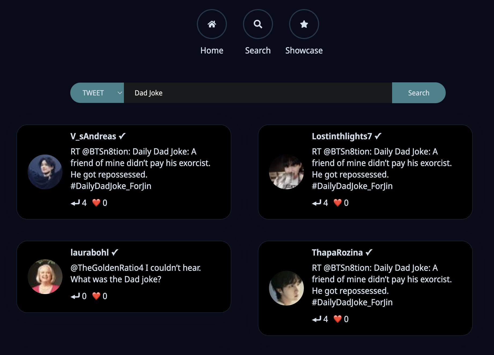

# Twitter Showcase

*An app that allows you to search for Twitter Users and Tweets. 
Written in React/TS on the Frontend and NodeJS/Express on the Backend.*

View it [here](https://twitter-showcase-1bin.onrender.com/home)

## Summary

This application, designed with React/TS on the frontend and NodeJS/Express on the backend, enables efficient searching for Twitter users and tweets. When a user submits a search, the frontend sends a GET request to the backend, which then triggers a corresponding GET request to the Twitter API. Once the Twitter API responds, the backend checks for errors, formats the data, and sends it back to the frontend for display to the user.

Navigating the Twitter API's various access tiers was initially challenging. I thoroughly reviewed the API documentation to ensure I was authorized to make specific requests and access the needed information. Every request to this API required authorization via a bearer token, so I used dotenv variables for confidentiality and configured the bearer token within an axios instance, streamlining the codebase by eliminating unnecessary lines.

I learned that deploying a fullstack app is very different from deploying a static website. Upon successful deployment, I deepened my understanding of npm scripts, the build process, and the nuances of deploying across different environments.

## Author
- John Clampet: FullStack Software Developer
- [LinkedIn](https://www.linkedin.com/in/john-clampet-264007122/)
